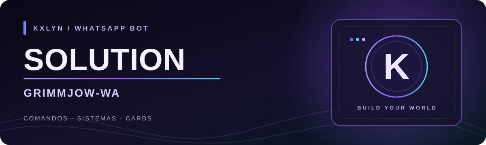

<div align="center">
  
  <br><br>
  <a href="https://github.com/DiscNet/Solution"></a>
  
  
  
</div>

# Solution · GrimmJow-WA

Bot de WhatsApp mantido por **Kxlyn**, com comandos para grupos, mídia, utilidades e sistemas de jogo. O prefixo padrão é `.`. A estrutura foi reunida em `DADOS/MÓDULOS/`, com plugins por categoria e textos de menu separados da lógica dos comandos.

## ✦ O que o bot reúne

| Área | Exemplos no projeto |
| --- | --- |
| 🧭 **Menus** | `.menu` apresenta a lista com botões ou um menu geral em texto; `.menurpg`, `.menuadm` e outros mostram categorias com imagem. |
| 🛡️ **Grupos** | Administração, boas-vindas, filtros e ferramentas para moderadores. |
| 🎮 **Sistemas** | RPG, Pokémon, coins, progressão e rankings do próprio bot. |
| 🎧 **Mídia** | Busca e downloads, figurinhas, imagens e comandos de áudio. |
| ✨ **Utilidades** | Perfil, ping, ferramentas de texto e comandos integrados à API. |

Alguns comandos de busca, download e IA precisam de serviços externos ativos e de uma chave configurada para funcionar.

## 🧭 Menus e mensagens em grupos

Com botões, `.menu` conserva a lista interativa e a imagem de apresentação. Sem botões, envia uma única imagem com o menu geral na legenda: uma seção por área e um comando por linha, começando por Figurinhas e Downloads. Essa seleção fica em `DADOS/MÓDULOS/mensagens/menus.js`. Os outros menus, como `.menu adm` e `.menuadm`, continuam organizados por categoria e seção, com suas imagens.

Grupos novos recebem respostas **sem botões** por padrão. Um administrador pode consultar ou alterar esse modo com `.sembotoes`, `.sembotoes 1` (texto) e `.sembotoes 0` (permitir botões). A escolha é salva por grupo. No modo de texto, opções interativas aparecem como comandos para digitar; por exemplo, `.autofigu` mostra o estado e indica `.autofigu 0` quando estiver ativo.

Quando o bot inicia, os grupos dos quais ainda participa e que têm aluguel ativo recebem um aviso de reinício no formato padrão. O dono pode cancelar um plano com `.cancelar-aluguel` dentro do grupo ou `.cancelar-aluguel ID@g.us` no privado. Figurinhas criadas pelo `.autofigu` ocupam um quadro de **512 × 512 pixels** tanto para imagens quanto para vídeos.

## 🛡️ Proteção dos grupos

Administradores podem cadastrar palavras ou frases com `.addpalavra texto`, consultar `.listapalavra`, remover com `.delpalavra texto` e ativar o filtro usando `.antipalavra 1`. O filtro apaga a mensagem detectada; com `.autoban 1`, também remove o autor. As remoções automáticas ficam registradas em `.modlog` com o motivo.

Para impedir o retorno de um membro, use `.addlistanegra @membro` (ou informe número/ID). `.listanegra` mostra os bloqueios e `.dellistanegra número-da-lista` retira um deles. O bot recusa pedidos de entrada bloqueados e remove o membro se ele entrar por outro caminho, desde que tenha permissão de administrador no grupo.

## 🎨 Visual dos menus

<div align="center">
  
  <br>
  <sub>Arte de menu já incluída no Solution.</sub>
</div>

## 🚀 Rodar localmente

Requer **Node.js 22.22.2 ou superior**. Depois de clonar o repositório:

```bash
npm install
npm run connect
npm start
```

`npm run connect` faz o pareamento e cria a sessão usada pelo bot. Nas próximas inicializações, use `npm start`. O script de início prepara a sessão e carrega `DADOS/index.js`.

## Atualizações no Termux e na hospedagem

No WhatsApp, o dono pode usar `.up` ou `.up start` para instalar, `.up check` para consultar e `.up rollback` para restaurar o último backup. `.update` sem argumento apenas consulta. No terminal:

```bash
npm run up
npm run update:check
npm run update:rollback
```

O updater preserva a sessão, os dados dos grupos, a configuração local, `.env`, `.npmrc` e `bridge.toml`. Baixa o código para uma pasta temporária, verifica integridade e sintaxe e cria backup antes de aplicar. Alterações apenas nos scripts de `package.json` não reinstalam dependências. Quando elas mudam, a instalação ocorre separadamente; falhas mantêm o código e os módulos anteriores. Uma interrupção durante a aplicação é recuperada na próxima inicialização com `npm start`.

O Termux usa automaticamente o `tnode` instalado para Git, npm e reinício. O npm também pode ser executado pelo Node quando seu script não tem permissão de execução. O download Git usa armazenamento interno mesmo se o bot estiver em `/sdcard` ou `~/storage/shared`. O tnode não instala compiladores ou bibliotecas de sistema necessários a módulos nativos.

Se a versão antiga do updater estiver quebrada, pare o bot e execute **na pasta do projeto**:

```bash
curl -fL https://raw.githubusercontent.com/DiscNet/Solution/main/DADOS/update-bootstrap.js -o "$TMPDIR/solution-update.js"
tnode node "$TMPDIR/solution-update.js" "$PWD"
tnode npm start
```

Em um ambiente sem tnode, use `node` e `npm` diretamente. Depois de instalado o código novo, `npm run update:repair` também executa essa recuperação. `npm start` mantém o supervisor ativo para reiniciar depois de `.up`; uma execução direta de `DADOS/index.js` informa a necessidade de reinício manual.

Os logs têm horário, etapa e nível. A arte ASCII usa `lolcat` quando disponível; sem ele, mantém cores ANSI. Para habilitar o efeito no Termux, use `pkg install ruby` e `gem install lolcat`. `NO_COLOR=1` desliga cores e `BOT_LOG_TIMEZONE` altera o fuso (padrão: `America/Fortaleza`).

Validação do updater: `npm run test:update`. Os testes usam repositórios Git locais e simulam o ambiente Termux/tnode, incluindo falha de instalação, concorrência, rollback e interrupção do processo.

Para os comandos integrados à API, configure `TOKITO_API` no ambiente. Outras integrações podem pedir variáveis próprias; consulte `DADOS/config/config.js` antes de ativá-las.

> **Sessão:** `DADOS/conexão/bot_auth/` contém credenciais de conexão. Trate essa pasta como privada. Em uma implantação nova, prefira armazenar a sessão em um volume ou usar `AUTH_INFO_B64`, que o inicializador reconhece.

## 🗂️ Organização

| Caminho | Responsabilidade |
| --- | --- |
| `DADOS/MÓDULOS/plugins/` | Comandos divididos por categoria. |
| `DADOS/MÓDULOS/mensagens/` | Menus, mensagens e respostas de erro. |
| `DADOS/MÓDULOS/sistemas/` | Regras e contexto dos sistemas do bot. |
| `DADOS/database/` | Dados e estados dos recursos, incluindo os filtros de moderação. |
| `DADOS/MÓDULOS/functions/` | Integrações, renderização e funções compartilhadas. |
| `DADOS/config/config.js` | Configuração geral do bot. |
| `DADOS/conexão/` | Caminho de sessão e pasta `bot_auth/` do WhatsApp. |
| `DADOS/core/` e `DADOS/eventos/` | Inicialização, conexão e eventos. |
| `DADOS/imagens/` | Artes usadas nas mensagens e neste README. |

O comando de produção é `npm start`; o `Dockerfile` da raiz instala as dependências e inicia o mesmo script.

---

<div align="center">
  <strong>Solution</strong> · feito e mantido por <strong>Kxlyn</strong>
</div>
